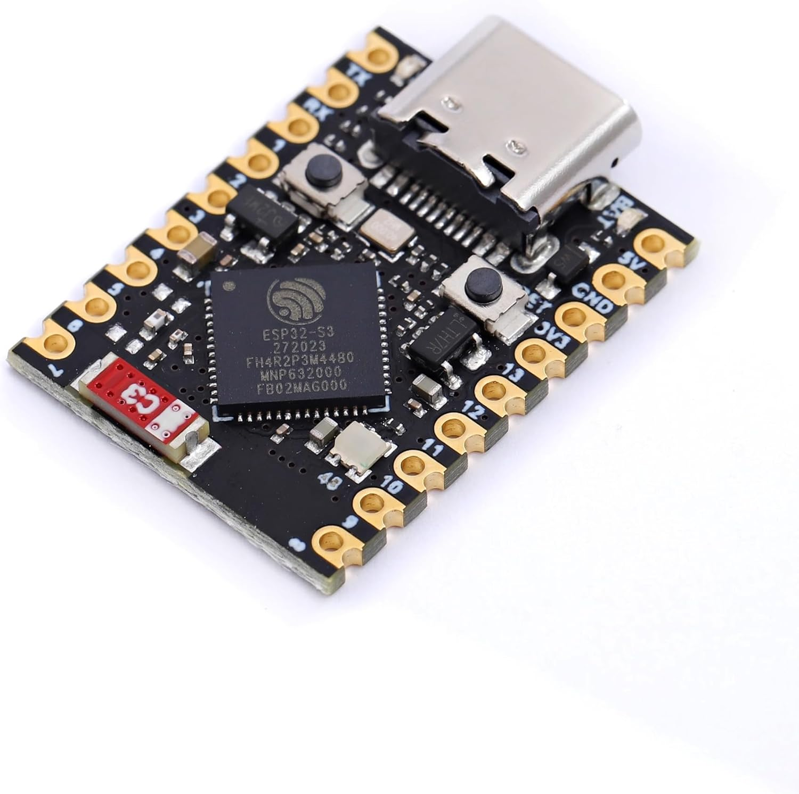
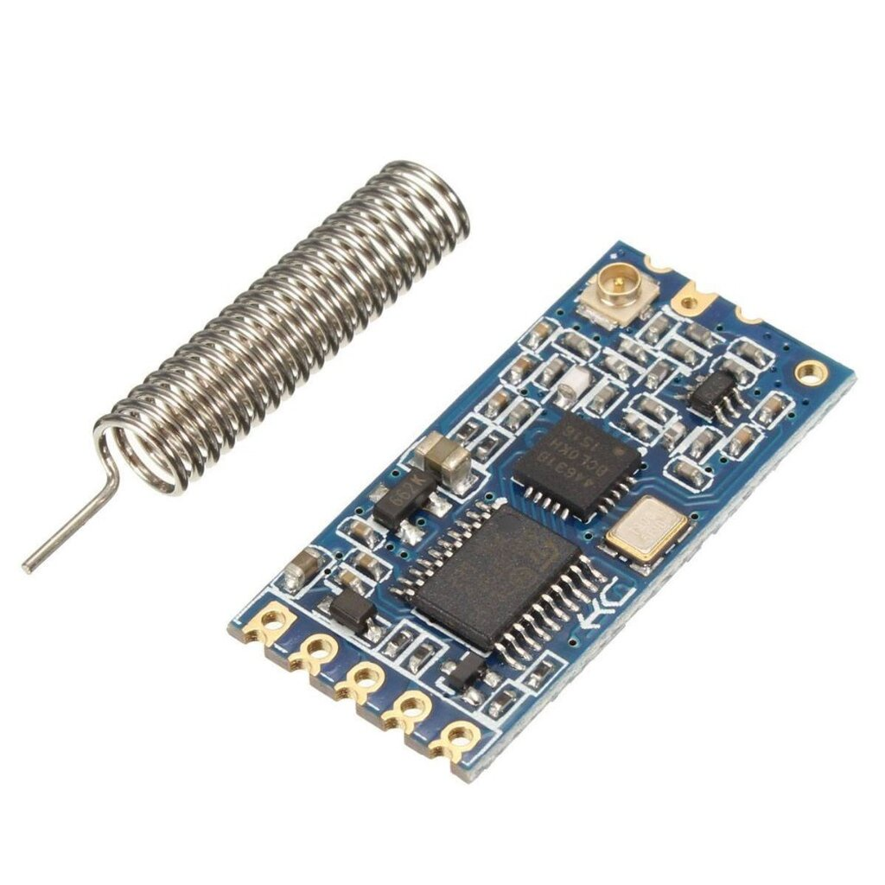

## 📡 ESP32S3 + HC-12 433MHz Communication System

This system is designed to allow an **ESP32S3** to receive data **wirelessly via an HC-12 (433 MHz) module** and control devices such as an LED and a buzzer using a custom-defined protocol over serial communication.

---




### 🧠 Components Used

- **ESP32S3 Mini**
- **HC-12 (SI4463) Wireless Serial Module @ 433MHz**
- **WS2812 LED x1**
- **Active Buzzer**
- **Python (sender)** + `pyserial`

---

## ⚙️ System Overview

| Python Side (`PacketSender433Mhz`) | ESP32 Side (`receiveData`, `handlePacket`) |
| --- | --- |
| Builds packets | Receives packets via UART from HC-12 |
| Adds Header / Type / Payload / Checksum | Validates packet (header, checksum, end byte) |
| Queues data + sends with delay | Controls LED / buzzer based on received data |

---

## 🔐 Custom Serial Packet Protocol

### ✅ Packet Format

```
[HEADER][TYPE][LENGTH][ID (8 bytes)][PAYLOAD][CHECKSUM][END]

```

| Field | Size | Description |
| --- | --- | --- |
| `HEADER` | 1 byte | Always `0xAA` |
| `TYPE` | 1 byte | Message type (see below) |
| `LENGTH` | 1 byte | Total length of `[ID + PAYLOAD]` |
| `ID` | 8 bytes | Device ID (e.g. `"DEVICE01"`) |
| `PAYLOAD` | N bytes | Type-specific data (e.g. `"red"`) |
| `CHECKSUM` | 1 byte | XOR of header, type, length, and sum(payload) |
| `END` | 1 byte | Always `0x55` |

---

### 📥 Example Packet (Python → ESP32)

Sending the command `"red"` to device `DEVICE01`:

```python
MessageType = COLOR (0x01)
ID ="DEVICE01"
Payload ="red"

```

- Header: `0xAA`
- Type: `0x01`
- Length: `8 (ID) + 3 (payload) = 11`
- ID: `44 45 56 49 43 45 30 31` (`DEVICE01`)
- Payload: `72 65 64` (`red`)
- Checksum: XOR of header, type, length, and sum(payload)
- End: `0x55`

---

### 📦 MessageType Enum

| Name | Value | Description |
| --- | --- | --- |
| `COLOR` | `0x01` | Change LED color |
| `NUMBER` | `0x02` | Send a numeric value |
| `STATUS_MSG` | `0x03` | Send status information |
| `TEXT` | `0x04` | General text message |

> ⚠️ On the ESP32 side, STATUS_MSG is used instead of STATUS to avoid naming conflicts with the system.
> 

---

## 💡 Example Behavior (ESP32)

If the ESP32 receives a packet with:

- `ID == DEVICE01`
- `TYPE == COLOR`
- `PAYLOAD == "blue"`

The ESP32 will:

- Turn the LED blue
- Play a short **Jingle Bells** melody
- Turn off the LED after playback finishes

---

## 🐍 Python Sender (main.py)

```bash
python main.py

```

The Python script will:

- Build packets
- Queue packets
- Send data over Serial (`/dev/tty.usbserial-1230`)
- Support delays and automatic ordering

---

## 🚀 Usage

### Wiring:

- ESP32 TX2 (GPIO14) → HC-12 RX
- ESP32 RX2 (GPIO13) → HC-12 TX
- 5V, GND

### Steps:

1. Flash the code to the ESP32
2. Run the Python script (`main.py`)
3. Monitor the LED and serial output
